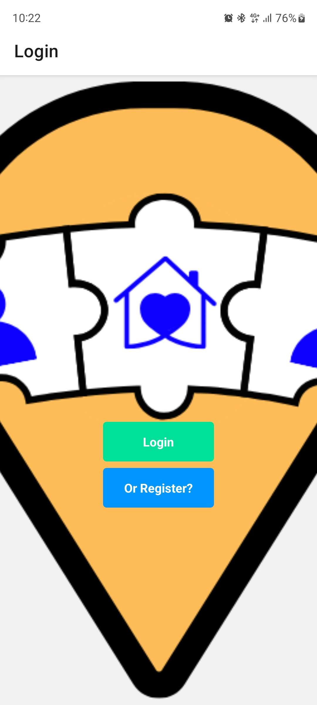
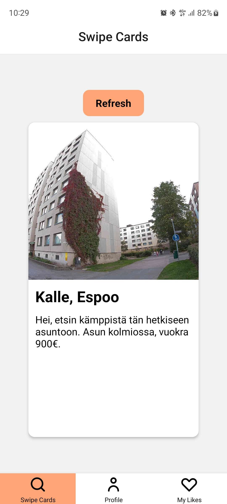
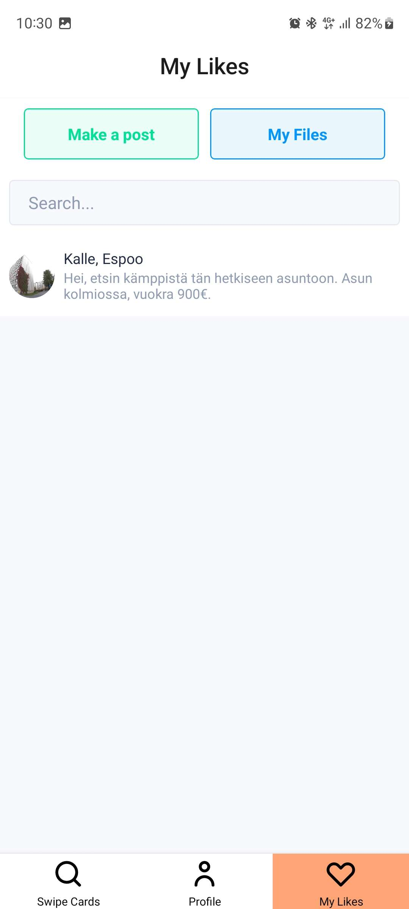
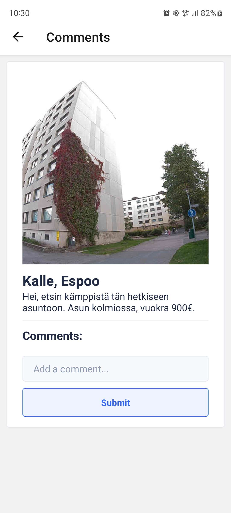

# KämppisTinder

App for students to search for appartments and roommates. Swipe through posts and start chatting with people.


## Installation

Clone the project to a folder ```git clone https://github.com/JerbsH/kamppistinder``` and run ```npm install```
In utils folder create a file named apiKey.js. In the file add this:
```const googleMapsApiKey = 'YOUR_API_KEY_HERE'; export default googleMapsApiKey;```

## Features

- Swipeable cards
- Sending messages to post creator
- Uploading a picture
## Screenshots







## Authors

- Ella [@ellasig](https://github.com/ellasig)
- Jere [@JerbsH](https://github.com/JerbsH)
- Miika [@Miikajok](https://github.com/MiikaJok)

